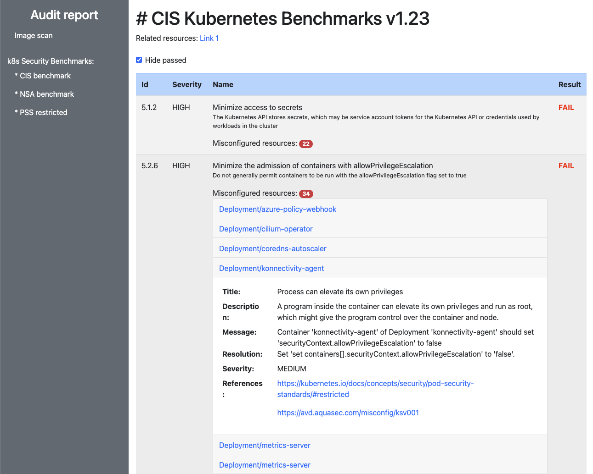

# Production readiness

This tool will help running diagnostic to have a better understanding of a cluster in terms of security and best practises.
Use it to identify security vulnerabilities in your cluster and container images. 

## Prerequisites

To prepare your environment you must install [trivy](https://github.com/aquasecurity/trivy) and `docker`
as the image scan utility require both command line tools.
Then download the `production-readiness` tool from the [releases](https://github.com/coreeng/prod-readiness/releases) area.

## Cluster scan

The `report` command will perform both [container image scan](#Container-image-scanning) and [security compliance scan](#Cluster-security-compliance-scanning).
You can run either report individually by referring to the corresponding sections below. 

The command will generate an `HTML` report for all types of scans. 
The summary report can be opened by opening `index.html` in the browser.

### Usage 

```
production-readiness report  --context <cluster-name>
```

## Container Image scanning

The `scan` command can be used to scan your container images for vulnerabilities.
It will look up running containers in all namespaces that matches an optional label selector (`--filters-labels`)
and perform a vulnerability scan against using [trivy](https://github.com/aquasecurity/trivy) for each container image.
It will then generate an `HTML` or `Markdown` report summarising the vulnerabilities found, their severity, CVE reference
and how many containers are affected.

It can also provide a break down of the vulnerabilities per area (`--area-labels`) / team (`--teams-labels`) when specified.

Here is a sample report:


### Usage

To generate a report for a given cluster:
```
production-readiness scan --context <cluster-name>
```

To generate a report broken down per team name, specify the `label` used to identify the team name:
```
production-readiness scan --context <cluster-name> --teams-labels=<label>
```

Run `production-readiness scan --help` for a complete list of options available.


### Rendering the report as HTML, Mark-down or PDF

The vulnerability report can be rendered using the template of your choice.
There are two available templates for convenience:
- `html`: [report-image-scan.html.tmpl](./report-image-scan.html.tmpl)
- `markdown`: [report-image-scan.md.tmpl](./report-image-scan.md.tmpl)

A custom template file can be specified using the `--report-template-filename` command line argument.

HTML files can be converted to PDF files in various ways.
One tool that works for us is [wkhtmltopdf](https://wkhtmltopdf.org/downloads.html) which can be use as follows:
```
wkhtmltopdf <report.html> <report.pdf>
```

## Cluster security compliance scanning

The `cis-scan` command can be used to scan compliance of the cluster with the k8s CIS benchmark, NSA k8s Hardening Guidance and Pod Security Standards (PSS).
It will perform a compliance scan against using [trivy](https://github.com/aquasecurity/trivy) for whole kubernetes cluster.
Then it will generate an `HTML` report and will show which criteria has been passed and which failed.
Report allows to see vulnerable resources, their severity, description, suggested resolution and references.

Here is a sample report:



### Usage

To run compliance scan just execute: `production-readiness cis-scan --context "sandbox-azure"` 
`--context` points to context to use from kube config file.
Optional parameter `--benchmarks k8s-cis,k8s-nsa,k8s-pss-restricted` can be used to run specific scan type.

### Limitations

- At the moment, cluster admin privileges is required by trivy as it needs to create `trivy-tmp` namespace just for testing purposes. The tool should be modified to work with 'read-only' permissions to the cluster or at least within a namespace we (CECG) own. We need to be super careful especially with live environments.
- Security compliance scans may not work on GCP if there is no CNI on the node in `/opt/cni/bin` location

## Roadmap

- Use trivy library rather than the command line (to prevent: "trivy": executable file not found in $PATH ) - see [#17](https://github.com/coreeng/prod-readiness/issues/17)
- Use docker library rather than the command line (to prevent: "docker": executable file not found in $PATH ) - see [#17](https://github.com/coreeng/prod-readiness/issues/17)
- Run CIS benchmark with limited permissions - see [#18](https://github.com/coreeng/prod-readiness/issues/18)
- Improve CIS benchmark report - see [#14](https://github.com/coreeng/prod-readiness/issues/14)
- Run cloud provider specific CIS benchmark - see [#21](https://github.com/coreeng/prod-readiness/issues/21)
