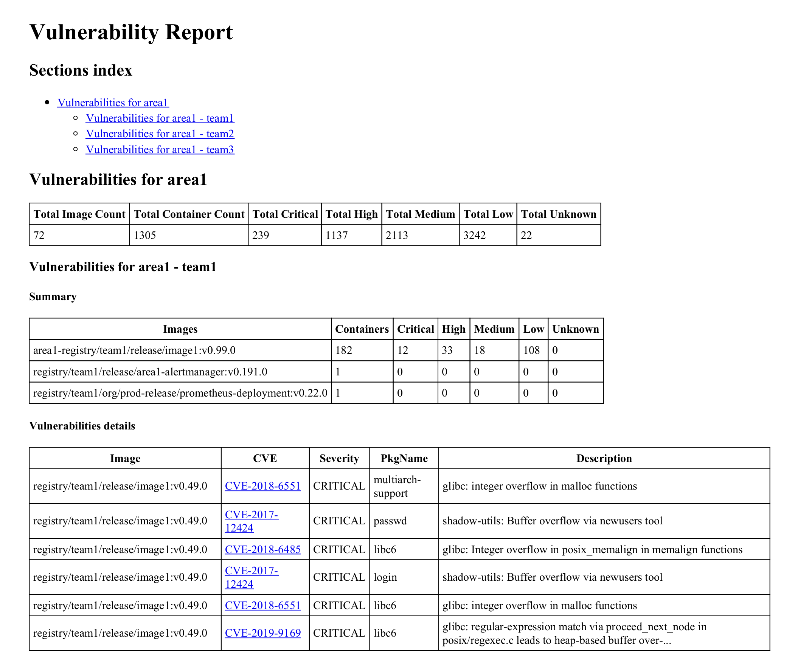

# Production readiness

This tool will help running diagnostic to have a better understanding of a cluster in term of security and best practises.

## Container Image scanning

The `scan` command can be used to scan your container images for vulnerabilities.
It will look up running containers in all namespaces that matches an optional label selector (`--filters-labels`)
and perform a vulnerability scan against using [trivy](https://github.com/aquasecurity/trivy) for each container image.
It will then generate an `HTML` or `Markdown` report summarising the vulnerabilities found, their severity, CVE reference
and how many containers are affected.

It can also provide a break down of the vulnerabilities per area (`--area-labels`) / team (`--teams-labels`) when specified.

Here is a sample report:


### Usage

To prepare your environment you must install [trivy](https://github.com/aquasecurity/trivy) and `docker`
as the image scan utility require both command line tools.

```
production-readiness scan --context cluster-name --area-labels=area-name --teams-labels=team --image-name-replacement='mirror.registry:5000|registry.new.url,mirror-2.registry:5000|registry.new.url'
```

Run `production-readiness scan --help` for a complete list of options available.


### Rendering the report as HTML, Mark-down or PDF

The vulnerability report can be rendered using the template of your choice.
There are two available templates for convenience:
- `html`: [report-image-scan.html.tmpl](./report-image-scan.html.tmpl)
- `markdown`: [report-image-scan.md.tmpl](./report-image-scan.md.tmpl)

A custom template file can be specified using the `--report-template-filename` command line argument.

HTML files can be converted to PDF files in various ways.
One tool that works for us is [wkhtmltopdf](https://wkhtmltopdf.org/downloads.html) which can be use as follows:
```
wkhtmltopdf <report.html> <report.pdf>
```

### TODOs

- use trivy library rather than the command line
- use docker library rather than the command line
- releasing

## Kubebench

_This is work in progress_


## Linuxbench

_This is work in progress_

